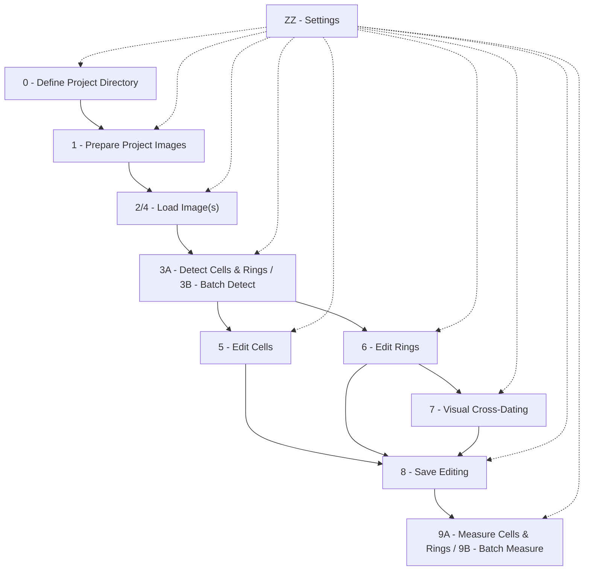

# User Guide: Widgets & Tools

`napari-roxas-ai` provides a modular suite of widgets within the napari environment designed to take your wood cross-section images through the entire Quantitative Wood Anatomy (QWA) pipeline—from raw image preparation to deep-learning segmentation, interactive manual curation, visual cross-dating, and anatomical feature extraction.

Widgets are numbered in the napari **Plugins > ROXAS AI** menu according to their typical execution sequence.

---

## Overview of the Workflow & Widgets



| Widget Number & Name | Primary Purpose | Input | Output |
| :--- | :--- | :--- | :--- |
| **0 - Define project directory** | Set the active working directory for the project | Folder path | Global project path in settings |
| **1 - Prepare project images for analysis** | Standardize filenames, extract EXIF/DPI, store initial metadata | Raw images (`.jpg`, `.tif`, etc.) & cross-dating files | `.scan.<ext>`, `.metadata.json`, `rings_series.crossdating.txt` |
| **2/4 - Load image(s)** | Load sample scans and existing label masks into napari | Prepared sample files | Napari Image & Labels layers |
| **3A - Detect cells & rings (individual image)** | Run deep-learning segmentation on currently loaded scan | Active napari scan layer | `.cells` and `.rings` Labels layers |
| **3B - Batch detect cells & rings** | Run AI segmentation on multiple samples in the background | Prepared project directory | `.cells.png`, `.rings.tif`, `.metadata.json` |
| **5 - Edit cells** | Manually refine cell segmentations (raster brush/eraser or vector contours) | `.cells` layer | Edited `.cells` layer |
| **6 - Edit rings** | Manually adjust, add, delete, or re-detect tree-ring boundaries | `.rings` layer | Edited `.rings` layer & updated ring years |
| **7 - Visual cross-dating** | Synchronize ring-width series against master reference chronologies | `.rings` layer & crossdating file | Calibrated ring years & verified sample dating |
| **8 - Save cells & rings editing** | Persist manual edits from napari viewer back to disk | Active napari layers | Updated `.cells.png`, `.rings.tif`, `.metadata.json` |
| **9A - Measure cells & rings (individual image)** | Calculate anatomical variables for active sample in viewer | `.cells` & `.rings` layers | `.cells_table.txt`, `.rings_table.txt` |
| **9B - Batch measure cells & rings** | Calculate anatomical variables for all samples in directory | Project directory | Measurement tables for all samples |
| **ZZ - Settings** | Configure global defaults, hardware acceleration, file extensions, and thresholds | User settings | `settings.json` configuration file |

---

## 0 - Define Project Directory

The **Define Project Directory** widget configures the root folder where your sample images, metadata, and analysis tables reside.


*Figure 1: Project directory selection dialog.*

### How It Works
When triggered from the menu, it opens a system folder browser. Selecting a folder updates the `project_directory` entry in `settings.json`. All subsequent loading, saving, and batch processing widgets default to this directory.

### Key Controls
- **Select Project Directory**: Prompts the user to pick a folder. Upon confirmation, a notification displays the chosen path.

---

## 1 - Prepare Project Images for Analysis

The **Prepare Project Images** widget standardizes raw microscopy or flatbed scans and associated cross-dating text files into the structured file naming conventions and data structures required by ROXAS AI.


*Figure 2: Sample preparation widget interface.*

### How It Works
1. Scans the selected project directory (and subdirectories) for supported image formats (`.jpg`, `.jpeg`, `.png`, `.tif`, `.tiff`, `.bmp`, `.jp2`).
2. Opens an interactive **Metadata Dialog** for each sample to capture physical dimensions, spatial resolution ($\mu\text{m}/\text{px}$ or DPI), sample type (e.g., `conifer`), measurement geometry (`linear`), and the outermost complete calendar year.
3. Automatically standardizes filenames to `<sample_name>.scan.<ext>` and creates a synchronized `<sample_name>.metadata.json`.
4. Discovers and merges external cross-dating series (e.g., Tucson `.rwl`, `.tuc`, or tabular `.txt`/`.csv` files) into a unified reference file (`rings_series.crossdating.txt`, configured as `[".crossdating", ".txt"]` in `settings.json`) scaled to micrometers ($\mu\text{m}$).


*Figure 3: Interactive metadata prompt dialog during image preparation.*

### Cross-Dating Text Files Processing

The **Start Processing Crossdating Files** action allows you to import and compile one or more external tree-ring width (TRW) measurement files or master reference chronologies into a single synchronized project cross-dating file.


*Figure 4: Dialog for selecting cross-dating files and setting unit scaling.*

#### Supported Input File Formats
The cross-dating parser automatically recognizes and parses several standard dendrochronological and tabular formats:

- **Tabular Files (`.csv`, `.tsv`, `.txt`)**:
    - **Delimiters**: Auto-detected among tab (`\t`), comma (`,`), or semicolon (`;`).
    - **Structure**: Column-oriented or matrix tables where the first column or index contains the calendar year (`YEAR`), and additional columns contain tree-ring width series for individual trees, radii, or site chronologies.
    - **Header handling**: Automatically detects whether headers with series names exist or if the file contains pure numeric columns.

    *Example Tabular Input (`sample_series.txt` or `sample_series.csv`, values in $1/100\,\text{mm}$):*

    | YEAR | Series01 | Series02 |
    | :--- | :--- | :--- |
    | 2018 | 142 | 165 |
    | 2019 | 118 | 130 |
    | 2020 | 155 | 148 |
    | 2021 | 98 | 112 |
    | 2022 | 125 | 135 |

- **Tucson / Decadal Files (`.rwl`, `.tuc`)**:
    - **Raw Tucson Decadal Format**: Standard space-delimited format used by dendrochronology software (e.g., COFECHA, ARSTAN, TSAP-Win). Each line contains `series_id`, `start_year`, and up to 10 ring-width values followed by end-of-series sentinel markers (`-9999`, `-999`, `9999`, or `999`).
    - **Tab-Delimited ("Doctored") Tucson Format**: Tucson decadal files where fields are separated by tab characters. The parser identifies sentinel stop values and pivots the decadal entries into continuous annual time series.

    > **ATTENTION**: Tucson/decadal files must be saved with the `.rwl` or `.tuc` extension. If an RWL file is saved or renamed with a `.txt` extension, it will not be processed correctly because the parser will attempt to read it as a standard tabular file rather than a decadal file.

    *Example Tucson Input (`site_chronology.rwl`, values in $1/100\,\text{mm}$):*

    ```text
    Series01 2010   110  125  130  142  118  155   98  125  140  150
    Series01 2020   160  135  120 -9999
    ```

#### Unit Scaling Conversion
Because tree-ring measurement devices export widths in varying units, the selection dialog allows specifying the unit scale of the input files to convert all values into standard **micrometers ($\mu\text{m}$)**:

| Selected Unit Option | Multiplier Applied | Resulting Unit | Typical Use Case |
| :--- | :--- | :--- | :--- |
| **`1 / 100 mm`** *(default)* | $\times 10.0$ | $\mu\text{m}$ | Standard LINTAB / TSAP 1/100 mm resolution |
| **`1 / 10 mm`** | $\times 100.0$ | $\mu\text{m}$ | Low-resolution 0.1 mm measurement systems |
| **`1 / 1000 mm`** | $\times 1.0$ | $\mu\text{m}$ | Precision 1/1000 mm ($1\,\mu\text{m}$) stage micrometers |
| **`divide values by 10`** | $\times 0.1$ | $\mu\text{m}$ | Raw values recorded in tenths of micrometers |

#### Output File Structure
The compiled series is saved in the root of the project directory as `rings_series<crossdating_file_extension>` (by default `rings_series.crossdating.txt`, where `file_extensions.crossdating_file_extension` in `settings.json` is configured as `[".crossdating", ".txt"]`, which concatenates to `[".crossdating.txt"]`:

- **Format & Delimiter**: Tab-delimited plain text file (`\t` separator).
- **Index (`YEAR`)**: The first column is named `YEAR` and contains unique calendar years spanning the complete chronological range across all imported series, sorted in ascending order.
- **Series Columns**: Each imported file/series forms its own named column header (derived from series IDs or column labels in the source files).
- **Data Alignment & Missing Values**: Ring widths are aligned by year across all series in micrometers ($\mu\text{m}$). Years not covered by a given series are left empty (`NaN`), allowing seamless integration of chronologies with differing time spans.

*Example Output File (`rings_series.crossdating.txt`, tab-delimited, values in $\mu\text{m}$ after applying $\times 10.0$ scaling):*

| YEAR | Series01 | Series02 |
| :--- | :--- | :--- |
| **2018** | 1420.0 | 1650.0 |
| **2019** | 1180.0 | 1300.0 |
| **2020** | 1550.0 | 1480.0 |
| **2021** | 980.0 | 1120.0 |
| **2022** | 1250.0 | 1350.0 |

### Key Controls & Options
- **Project Directory Button**: Displays and allows switching the active project directory.
- **Process already processed files**: When unchecked (default), skips files that already have the `.scan` extension.
- **Manually select files to process**: Expands a multi-selection list allowing selective processing of specific samples instead of the entire directory.
- **Reverse Selection**: Inverts the current file selection in the list.
- **Ignore ROXAS Output files**: Filters out visualization previews (e.g., `_annotated.jpg`, `_ReferenceSeries.jpg`).
- **Start Processing Image Files**: Launches the preparation worker thread with a live progress bar.
- **Start Processing Crossdating Files**: Opens the cross-dating file selection and unit conversion dialog to merge external ring-width files into the project reference series.

---

## 2/4 - Load Image(s)

The **Samples Loading Widget** loads prepared sample images (`.scan`), cell labels (`.cells`), and tree-ring labels (`.rings`) into napari with standardized colormaps, scaling, and navigation shortcuts.


*Figure 5: Samples loading widget with multi-sample selection.*

### How It Works
- Queries the project directory for prepared sample stems.
- Reads image layers along with their associated metadata (scale in $\mu\text{m}/\text{px}$, sample stem paths, and ring year metadata).
- Applies high-contrast colormaps (binary colormap for cells and distinct color cycling for rings).
- Automatically configures keyboard shortcuts (such as WASD keys for quick viewport panning) to streamline navigation across large high-resolution images.

### Key Controls
- **Project Directory**: Displays current project directory path.
- **Samples List**: Multi-select list showing all discovered samples.
- **Load Selected Samples**: Loads only highlighted samples into the layer list.
- **Load All Samples**: Loads all samples found in the project.
- **Progress Bar**: Displays sample loading progress.

---

## 3A - Detect Cells & Rings (Individual Image)

The **Single Sample Segmentation Widget** performs automated deep-learning inference to identify tracheid cell lumens and annual tree-ring boundaries on the currently displayed image.


*Figure 6: Single sample AI segmentation interface.*

### How It Works
- Runs neural network models (PyTorch / PyTorch Lightning / SMP architectures) locally on either GPU or CPU.
- **Cells Detection**: Predicts individual cell lumen instances and outputs a labeled mask layer (`<sample>.cells`).
- **Rings Detection**: Detects continuous tree-ring boundaries, sorts boundaries from bark to pith, enforces boundary continuity across the sample width, and constructs labeled annual ring bands (`<sample>.rings`).
- Post-processes masks to eliminate edge artefacts (e.g., boundary-touching partial cells).

### Key Controls & Options
- **Sample Selection**: Dropdown selecting the active `.scan` image layer.
- **Segment Cells / Segment Rings**: Checkboxes enabling cell detection, ring boundary detection, or both simultaneously.
- **Cells Model / Rings Model**: Selects the trained model checkpoint (`.pth`) to use from the `_models` directory.
- **Remove Border Touching Components**: Filters out cells that touch the scan boundary to avoid distorted anatomical metrics.
- **Overwrite Existing Layers**: Controls whether previous segmentation layers are replaced or updated.
- **Segment Sample Button**: Initiates the background segmentation process.

---

## 3B - Batch Detect Cells & Rings

The **Batch Sample Segmentation Widget** executes AI detection across multiple samples in the background without needing to load each image into the viewer.


*Figure 7: Batch segmentation widget.*

### How It Works
- Iterates over all discovered sample scans in the project directory.
- Applies the selected neural network models sequentially.
- Automatically saves segmentation masks (`.cells.png` and `.rings.tif`) directly to disk alongside updated `.metadata.json` files.

### Key Controls
- **Project Directory Selection**: Choose the target folder containing prepared samples.
- **File Selection Mode**: Toggle between batch processing all samples or handpicked subsets.
- **Segmentation Targets**: Checkboxes for **Segment Cells** and **Segment Rings**.
- **Model Dropdowns**: Select weights for cell and ring models.
- **Start Batch Segmentation**: Launches the batch worker with overall progress tracking.

---

## 5 - Edit Cells

The **Cells Layer Editor Widget** provides interactive manual editing tools to correct, split, merge, add, or erase cell lumen detections.


*Figure 8: Cells layer editor widget.*

### How It Works
- Temporarily transfers the active `.cells` layer into an editable working state.
- Supports two distinct editing paradigms:
  - **Edit As Raster**: Uses napari's native brush, paint bucket, and eraser tools directly on the label mask without geometric approximation.
  - **Edit As Vector**: Converts cell outlines into editable polygon shapes for precise vertex editing and splitting.
- When applied, rasterizes vectors back to label masks, re-indexes cell IDs uniquely, and preserves layer metadata.

### Vectorization, Rasterization & Smoothing
- **Vectorization & Contour Smoothing**:
  - When entering vector editing mode, cell lumen boundaries are extracted from the binary mask using `cv2.findContours`.
  - Contours are geometrically simplified and smoothed using the **Ramer-Douglas-Peucker algorithm** (`cv2.approxPolyDP` with `closed=True`) to eliminate single-pixel staircase artefacts while preserving anatomical shape fidelity.
  - Simplified polygons with fewer than 3 vertices are automatically discarded.
- **Rasterization**:
  - When applying vector edits, polygon vertices are rounded to integer pixel coordinates and filled onto a zero-initialized raster grid via OpenCV polygon contour rendering (`cv2.drawContours`). No secondary morphological smoothing is applied during this rasterization step.
- **Corresponding Settings & Default Values**:
  - `vectorization.cells_tolerance`: Maximum approximation distance $\epsilon$ (in pixels) for Douglas-Peucker contour simplification. (*Default:* `1`)
  - `vectorization.cells_edge_width`: Display line width (in pixels) of cell vector boundaries in the viewer. (*Default:* `5`)
  - `vectorization.cells_edge_color`: Display outline color for cell vector shapes. (*Default:* `"blue"`)
  - `vectorization.cells_face_color`: Fill color for cell vector shapes. (*Default:* `"cyan"`)
  - `rasterization.cells_color`: Default colormap color for rasterized cell lumens. (*Default:* `"lime"`)

### Key Controls
- **Cells Layer**: Dropdown selecting the target cells layer.
- **Edition Mode**: Switch between `Edit As Raster` and `Edit As Vector`.
- **Edit Cells Geometries**: Enters editing mode, hides original layers, and provides the temporary working canvas.
- **Apply Geometries Changes**: Commits edits, updates the `.cells` layer, and exits editing mode.
- **Cancel Geometries Changes**: Discards all pending modifications and restores the original layer state.

---

## 6 - Edit Rings

The **Rings Layer Editor Widget** enables precise curation of annual tree-ring boundaries, outermost year re-numbering, and targeted model-assisted re-detection.


*Figure 9: Rings layer editor with interactive shapes and year labels.*

### How It Works
1. Converts the raster ring mask into continuous polyline shapes representing each ring boundary.
2. Displays real-time calendar year labels (`Rings Years` overlay) along the sample.
3. Allows interactive vertex adjustments, insertion of missing boundaries, or deletion of false boundaries using napari shape tools.
4. Includes a **Lasso Selection Tool** to select and delete unwanted boundary vertices over a designated area.
5. Offers **Re-run Rings Model**: Re-runs the ring boundary detection AI specifically in areas where manual deletions occurred, using previous edits as boundary constraints.
6. When saved, completes boundary paths from edge to edge, validates ring ordering, and reconstructs the colored ring mask.

### Vectorization, Rasterization & Smoothing
- **Vectorization & Polyline Smoothing**:
  - Ring boundaries stored in the rings table (`RBXY` coordinate arrays) are converted into open polyline shapes (`path` shape type in napari).
  - Polyline smoothing and vertex reduction are performed using the **Ramer-Douglas-Peucker algorithm** (`cv2.approxPolyDP` with `closed=False`). Setting the tolerance to `0` disables smoothing and preserves all original pixel coordinates.
  - The same Douglas-Peucker simplification is applied to new boundary segments generated when using the interactive **Re-run Rings Model** feature.
- **Rasterization**:
  - When committing edits via **Apply Geometries Changes** (`update_rings_geometries` / `rasterize_rings`):
    1. Boundary coordinates are rearranged from left to right (`rearrange_coordinates`), clipped to image boundaries (`horizontal_rings_clipping`), and horizontally extrapolated to touch the canvas edges from $x=0$ to $x=\text{width}$ (`horizontal_rings_completion`).
    2. Boundaries are chronologically ordered from the outermost (bark side) to innermost (pith side) based on polygon area above each boundary (`calculate_polygon_area`).
    3. Adjacent boundary pairs are joined into closed polygons and rasterized into integer label masks using OpenCV filled polygon rendering (`cv2.fillPoly`).
- **Corresponding Settings & Default Values**:
  - `vectorization.rings_tolerance`: Maximum approximation distance $\epsilon$ (in pixels) for Douglas-Peucker polyline smoothing. Set to `0` to disable simplification. (*Default:* `5`)
  - `vectorization.rings_edge_width`: Display line thickness (in pixels) for ring boundary polylines. (*Default:* `10`)
  - `vectorization.rings_edge_color`: Display color for active ring boundary polylines. (*Default:* `"black"`)
  - `vectorization.rerun_interactive_edge_color`: Display color for newly detected boundaries generated by the interactive AI re-run tool. (*Default:* `"lime"`)
  - `rasterization.uncomplete_ring_value`: Integer label assigned to the topmost uncompleted ring zone. (*Default:* `-1`)
  - `rasterization.uncomplete_ring_color`: Display color for uncompleted ring regions. (*Default:* `"red"`)
  - `rasterization.rings_color_sequence`: List of alternating colors assigned cyclically to successive annual rings. (*Default:* `["blue", "green", "yellow", "purple", "orange", "cyan", "brown", "pink", "gray", "lime"]`)

### Key Controls & Options
- **Last Ring Year (SpinBox)**: Specifies the calendar year of the outermost complete annual ring.
- **Edit Rings Geometries**: Enters vector polyline editing mode and displays boundary lines.
- **Lasso Selection**: Checkbox activating lasso-based vertex selection.
- **Delete Lasso Vertices**: Removes all vertices enclosed by the lasso selection.
- **Re-run Rings Model**: Re-evaluates ring boundaries with tunable parameters:
  - *Confidence Threshold*: Minimum model confidence for boundary detection.
  - *Min Peak Distance*: Minimum distance between adjacent ring boundaries.
  - *Edge Margin*: Margin around borders excluded from peak detection.
- **Apply Geometries Changes**: Validates topology, updates `.rings` labels, updates `.rings_table.txt`, and saves year metadata.
- **Cancel Geometries Changes**: Reverts to original ring boundaries.

---

## 7 - Visual Cross-Dating

The **Cross-Dating Plotter Widget** couples tree-ring width (TRW) time series derived from detected rings with master reference chronologies in an interactive plotting environment.


*Figure 10: Visual cross-dating plotter synchronizing sample ring-width series with reference chronology.*

### How It Works
- Computes mean ring width (MRW) from the ring boundaries currently in the viewer.
- Renders dual interactive curves in a Matplotlib canvas: the sample series and the reference series.
- Allows interactive shifting along the time axis (year offset slider) or automated alignment to evaluate dating synchronization.
- Calculates statistical synchrony metrics in real time:
  - **Correlation coefficient ($r$)**
  - **Gleichläufigkeit (GLK / % sign agreement)**
  - **$t$-value / statistical significance**
- **Bidirectional Viewport Linking**: Clicking any data point in the cross-dating plot automatically centers and zooms the napari viewer onto the corresponding tree-ring boundary in the image.

### Cross-Dating Files Discovery & Folder Hierarchy Traversal

When a sample's tree-ring layer is selected in napari, the widget automatically locates associated cross-dating text files using an upward directory traversal algorithm:

1. **Starting Point**: The search begins in the directory containing the active sample scan (determined from `sample_stem_path`, the layer's file path, or the global `project_directory`).
2. **Search Direction (Strictly Upward)**:
    - The search is strictly **upward** (from the sample's directory towards the root of the file system).
    - The widget does **not** search downwards into subdirectories.
3. **Search Pattern & Prefix Requirements**:
    - The search matches files using the pattern `*<crossdating_file_extension>`, where `<crossdating_file_extension>` is the configured extension in `settings.json` under `file_extensions.crossdating_file_extension` (by default `[".crossdating", ".txt"]`, which concatenates to `.crossdating.txt`).
    - **Prefixes are supported**: Because of the leading wildcard `*`, any custom prefix before the extension is detected (e.g., `rings_series.crossdating.txt`, `siteA_chronology.crossdating.txt`, or `conifer_ref.crossdating.txt`).
    - **Suffixes are NOT supported after the extension**: The file must strictly end with the configured cross-dating extension (e.g., `.crossdating.txt`). If a file has an additional suffix after the extension (e.g., `.crossdating.txt.bak`) or a different extension (such as `.csv` when `.crossdating.txt` is configured), it will not be matched unless the extension setting in `settings.json` is updated.
4. **Upward Directory Tree Traversal Process**:
    - The widget first inspects the sample's immediate folder (`current_path.glob(pattern)`).
    - If one or more matching cross-dating files are found in that folder, search stops and those files are loaded.
    - If no matching file is found, it moves up to the parent directory (`current_path = current_path.parent`) and repeats the check.
    - The upward search continues through parent folders until matching files are found or it reaches the file system root.
    - **Architectural Workflow**: This allows placing a single global reference file at the project root directory (e.g., `<project_root>/rings_series.crossdating.txt`) to serve all samples in subfolders, or placing local reference files in specific sample subfolders (e.g., `<project_root>/SiteA/rings_series.crossdating.txt`), which automatically take priority for samples located within `SiteA`.

### Behavior When Multiple Cross-Dating Files Are Present

- **Multiple Files in the Same Directory**:
  - If two or more matching cross-dating files exist within the first directory where matches are found (e.g., `<project_root>/rings_series_site1.crossdating.txt` and `<project_root>/rings_series_site2.crossdating.txt`):
    - All discovered cross-dating files are collected and populated into the **Crossdating File** dropdown combobox (`_crossdating_file_combo`).
    - The widget automatically selects the first file in the list by default.
    - Users can freely switch between files using the **Crossdating File** dropdown. Selecting a different file immediately re-reads the dataset, recalculates the series average, updates the **Reference Series** dropdown with all series columns from that file, and refreshes the plot.
- **Files in Different Directory Levels**:
  - Because traversal stops at the first directory containing matches, a cross-dating file located in a sample's local subfolder takes precedence over a cross-dating file located in parent or root directories.

### Key Controls & Options
- **Crossdating File Dropdown**: Selects among multiple detected cross-dating files in the directory tree.
- **Reference Series Dropdown**: Selects from individual series, site chronologies, or the auto-computed `"average"` column from the active cross-dating file. Automatically prioritizes columns whose names match the active sample stem.
- **Find Best Overlap Button**: Automatically scans temporal shifts to align sample and reference curves by maximizing correlation.
- **Year Range & Width Range Dual Sliders**: Interactively set X (calendar year) and Y (ring width in $\mu\text{m}$) viewing windows.
- **Offset Slider**: Manually shifts sample dating by $-50$ to $+50$ years relative to the reference chronology.
- **Apply Changes Button**: Confirms the adjusted temporal offset, updates ring boundary year numbering, shifts the `.rings` layer labels, and records the new outermost year in sample metadata.
- **Export Plot Button**: Saves the current cross-dating plot as a publication-ready `.jpg` image in the sample directory and records the validated reference series in `<sample_name>.metadata.json`.

---

## 8 - Save Cells & Rings Editing

The **Samples Saving Widget** writes modified cell masks, ring boundaries, and updated sample metadata from napari back to their respective files on disk.


*Figure 11: Samples saving widget.*

### How It Works
- Gathers data, layer parameters, and metadata from active napari layers.
- Formats and writes `.cells.png` (8-bit or 16-bit label rasters) and `.rings.tif`.
- Updates `<sample_name>.metadata.json` with updated ring counts, outermost year, and timestamps.
- Operates in a non-blocking background worker thread.

### Key Controls
- **Save Selected Layers**: Saves only the layers currently highlighted in the napari layer list.
- **Save All Layers**: Saves all recognized ROXAS AI layers in the viewer.
- **Progress Bar**: Shows disk write progress.

---

## 9A - Measure Cells & Rings (Individual Image)

The **Single Sample Measurements Widget** computes the full suite of Quantitative Wood Anatomy (QWA) metrics for the sample currently loaded in napari.


*Figure 12: Single sample measurements interface and parameter configuration.*

### How It Works
- Combines the `.cells` lumen mask and `.rings` boundary geometry with spatial resolution metadata ($\mu\text{m}/\text{px}$).
- Uses Continuous Wavelet Transform (CWT) and radial/tangential wall profiling to calculate:
  - **Cell Lumen Metrics**: Lumen Area ($LA$), Hydraulic Diameter ($DH$), Theoretical Hydraulic Conductance ($KH$), Aspect Ratio ($ASP$).
  - **Cell Wall Thickness (CWT)**: Radial ($CWTRAD$), Tangential ($CWTTAN$), Pith-side ($CWTPI$), Bark-side ($CWTBA$), Overall ($CWTALL$).
  - **Ring-Level Aggregates**: Mean Ring Width ($MRW$), Cell Density ($CD$), Conductive Area Fraction ($RCTA$), Mork's Index ($RTSR$), Relative Anatomical Density ($RWD$).
- Outputs tab-delimited tables: `<sample_name>.cells_table.txt` and `<sample_name>.rings_table.txt`.

### Key Parameters
- **Sample Selection**: Dropdown choosing the target sample from loaded layers.
- **Measure Cells / Measure Rings**: Checkboxes selecting which measurement levels to run.
- **Cluster DBL CWT Threshold ($\mu\text{m}$)**: Maximum double cell wall distance for identifying clustered cells / pit fields.
- **Smoothing Kernel Size**: Moving average kernel size for boundary smoothing (set to `1` to disable).
- **Wall Fraction for Thickness Measurement (`relwidth_cwt_integration`)**: Fraction of cell wall profile used to integrate wall thickness measurements.
- **Measure Sample Button**: Launches analysis in a background worker and attaches measurements to layer properties for interactive table inspection.

---

## 9B - Batch Measure Cells & Rings

The **Batch Sample Measurements Widget** runs the anatomical measurement engine across all samples in a project folder without requiring interactive display in the napari viewer.


*Figure 13: Batch measurements widget.*

### How It Works
- Discovers all matched pairs of `.cells` and `.rings` files in the project directory.
- Reads image scale and configuration from each sample's `.metadata.json`.
- Computes cell-level and ring-level measurement tables in batch mode.
- Writes `<sample>.cells_table.txt` and `<sample>.rings_table.txt` directly to each sample folder.

### Key Controls
- **Input Directory**: Path to project directory containing segmented samples.
- **Measure Cells / Measure Rings**: Checkboxes for target measurement outputs.
- **Measurement Configuration**: Adjust global CWT thresholds, integration fractions, and smoothing settings.
- **Start Batch Measurements Button**: Runs batch extraction with real-time progress updates.

---

## ZZ - Settings

The **Settings Widget** is a visual preferences manager that allows adjusting global defaults, file extensions, visualization parameters, and hardware settings without manual editing of JSON files.


*Figure 14: Global settings manager widget with collapsible categories.*

### How It Works
- Directly manages `settings.json` with dedicated input editors matching each data type (spinboxes, color selectors, list editors, checkboxes).
- Prevents syntax errors, invalid datatypes, or formatting corruption.
- Dynamically notifies and updates active widgets upon applying changes without requiring a napari restart.

### Key Settings Categories
1. **File Extensions**:
    - Standardized file suffixes for scans, cell masks, ring masks, metadata files, and tables.
2. **Hardware & Processing**:
    - `try_to_use_gpu`: Toggle CUDA / GPU acceleration for deep-learning segmentation.
    - Worker thread and batch settings.
3. **Visualization & Vectorization**:
    - Default colormaps for cell lumen layers.
    - Ring color sequence (alternating colormap for adjacent annual rings).
    - Display line widths and point sizes.
4. **Measurement Defaults**:
    - Default CWT integration widths, smoothing kernel sizes, and IQR outlier rejection multipliers.
5. **Metadata Schema**:
    - Default metadata prompts and fields presented during sample preparation.
